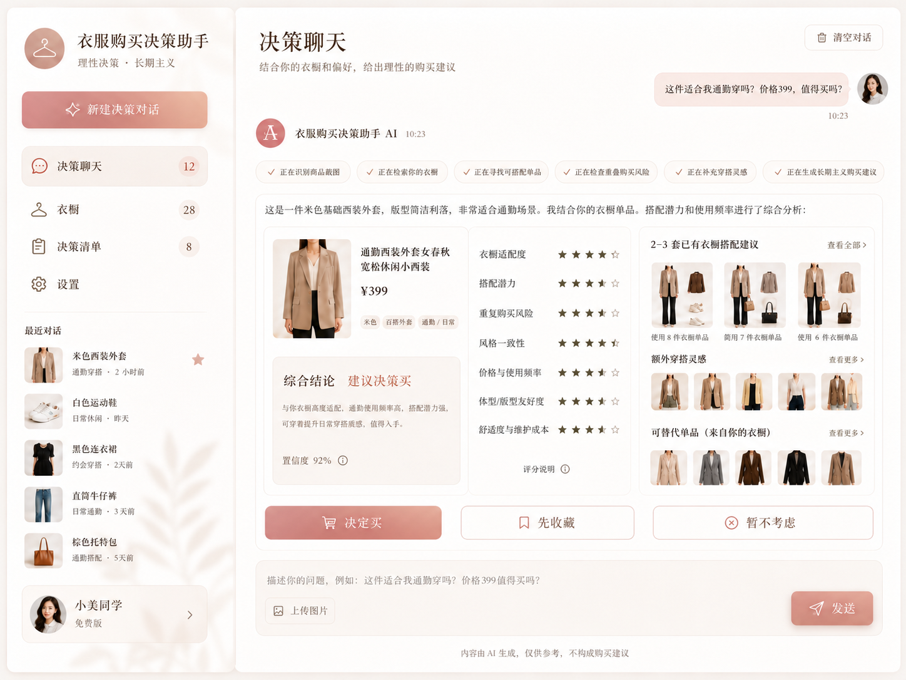
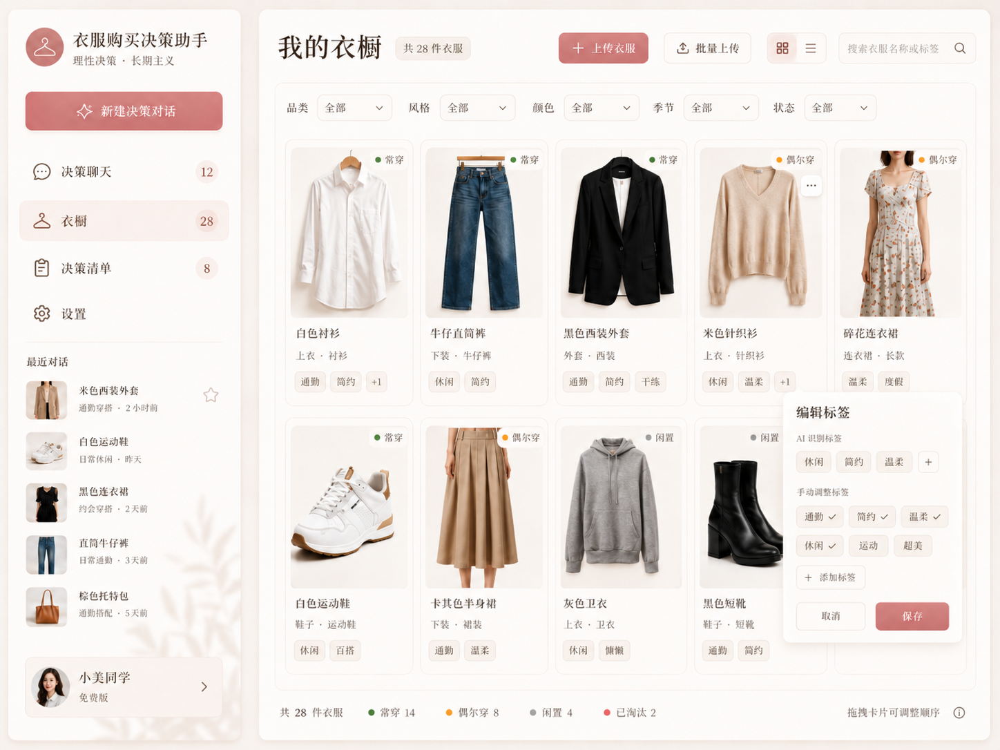
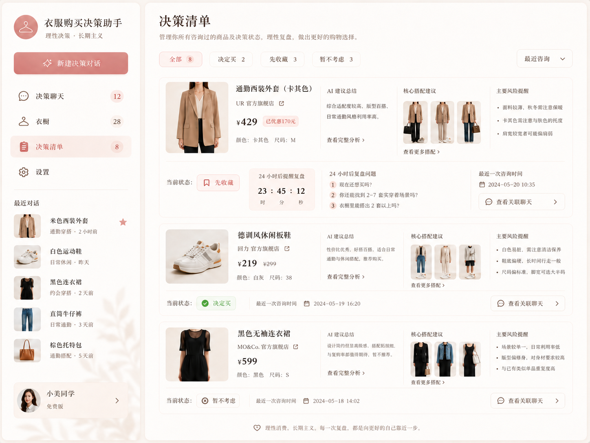
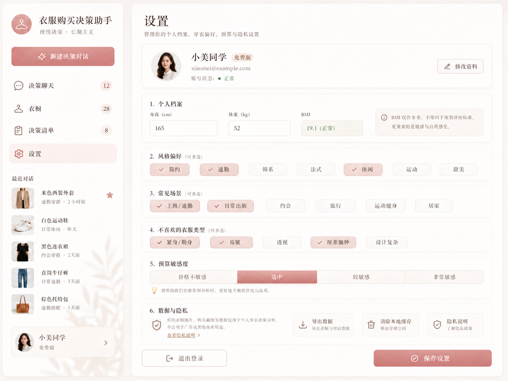

# 00. 作品集总览 Case Study

## 项目名称

**买对衣 — 基于个人衣橱的 AI 购买决策助手**

## 一句话介绍

买对衣帮助用户在买衣服前基于自己的真实衣橱、风格偏好和穿着场景做决策：这件衣服是否适合我、能不能和已有衣服搭起来、是否重复购买、是否值得现在买。

## 项目背景

很多用户并不是缺少购物渠道，而是缺少一个能在购买前帮助自己“冷静判断”的系统。

典型问题包括：

- 收藏和加购很多，但不知道哪些真正适合自己。
- 衣柜里衣服不少，却总觉得没衣服穿。
- 买到重复款、相似款或只适合少数场景的衣服。
- 被商品图、模特图、折扣和社交平台种草影响，忽略自己的真实衣橱。
- 很难在购物当下想清楚“已有衣服能不能搭出至少几套”。

传统电商产品目标往往是缩短购买路径，而买对衣的目标是提升购买质量：帮助用户少买错、多穿已有衣服、建立更长期的个人风格。

## 目标用户

核心用户：

- 对穿搭有兴趣，但容易冲动消费的人。
- 衣橱里单品不少，但搭配利用率不高的人。
- 经常收藏、加购，但难以判断是否值得买的人。
- 学生、职场新人、穿搭爱好者等预算和场景都需要被认真考虑的人。

使用场景：

- 看到一件商品截图，想知道是否适合自己。
- 逛街或刷内容平台时被种草，想快速判断是否只是冲动。
- 准备更新衣橱，希望避免重复购买。
- 想从已有衣服里挖掘更多搭配可能。

## 核心解决方案

买对衣通过“个人衣橱 + 商品截图 + AI 决策报告”形成闭环。

```text
个人档案
-> 上传已有衣服
-> AI 生成展示图并识别标签
-> 用户确认衣橱信息
-> 上传想买商品截图
-> AI 检索已有衣橱和穿搭知识
-> 输出购买决策报告
-> 用户选择决定买 / 先收藏 / 暂不考虑
-> 进入决策清单持续复盘
```

## 为什么需要 AI

普通衣橱工具能记录衣服，但很难在购买瞬间做跨信息判断。买对衣引入 AI 的原因是：

- 用户上传的衣服照片背景复杂，需要视觉模型提取品类、颜色、风格、场景。
- 商品截图包含图片、文字、价格和促销信息，需要多模态理解。
- 是否值得买不是单一规则判断，需要结合衣橱、风格、价格、场景和用户意图。
- 搭配建议需要从已有衣服中召回相关单品，再生成可解释理由。
- 用户需要自然语言解释，而不是只看一组标签或分数。

## AI 能力亮点

| AI 能力 | 引入动机 | 当前实现 | 价值 |
|---|---|---|---|
| Qwen-Image-Edit 展示图生成 | 用户上传照片常有衣架、背景和变形，直接拼搭配板效果差 | 原图生成白底/浅底高质量展示图 | 提升衣橱卡片和搭配报告的可读性 |
| Qwen-VL 衣服识别 | 手动录入标签成本高 | 原图 + 展示图双图识别品类、颜色、风格、场景 | 降低衣橱建库门槛 |
| 用户确认闭环 | AI 识别可能出错 | 标签进入确认面板，用户修正后才进入 embedding | 把 AI 从“自动真相”变成“可确认建议” |
| Embedding + RAG | 衣橱规模变大后不能全量塞入上下文 | 生成 embedding_text 并做衣橱召回 | 支撑搭配、重复和替代检索 |
| LangGraph 决策流 | 购买判断需要多步骤推理 | 商品识别、衣橱检索、知识检索、报告生成分节点执行 | 让 AI 决策过程可扩展、可维护 |

## 当前 MVP 完成度

已实现：

- 登录和个人档案。
- 云端衣橱图片上传。
- 原图保存与 Qwen-Image-Edit 展示图生成。
- Qwen-VL 衣服识别与标签确认。
- embedding 入库。
- 商品截图上传和识别。
- 衣橱匹配与购买决策报告。
- 决策状态保存和决策清单。
- 聊天页、衣橱页、决策清单页、设置页界面。

仍需完善：

- 线上部署和外部用户内测。
- 展示图与原图一致性的自动评分。
- 更完整的搭配板视觉输出。
- 内测数据看板和模型效果评估。
- 更稳定的多轮追问与用户反馈学习。

## 项目截图









## 作品集价值

这个项目体现的 AI 产品经理能力包括：

- 从用户痛点出发，而不是为了 AI 而 AI。
- 将多模态模型、图像编辑、RAG 和工作流编排拆成具体产品能力。
- 明确区分“展示增强图”和“事实来源”，控制生成式 AI 的幻觉风险。
- 设计人机协作确认流程，而不是完全自动化。
- 用指标评估 AI 是否真正提升用户决策质量。

